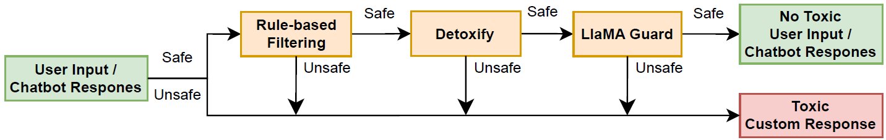

# Toxicity Detection

Standalone multilingual toxicity detection package extracted from the affective dialogue system. It provides a fast local rule-based detector by default and optional adapters for heavier moderation models such as Detoxify and Llama Guard.

The package is designed to stay lightweight on import: local rules run without model downloads, and ML dependencies are loaded only when their adapters are instantiated.

## Features

- Local deterministic checks for insults, threats, self-harm, explicit sexual content, criminal planning, illegal weapons, regulated substances, and prohibited terms.
- Spanish and English canned safety responses.
- Optional Detoxify adapter with configurable thresholds.
- Optional Llama Guard-style adapter for Hugging Face causal language models.
- Python API, command-line interface, tests, and CI-ready project metadata.

## Filtering Pipeline



The filter can be applied to both user inputs and chatbot responses. Messages are checked sequentially: fast local rules catch clear violations first, then optional model adapters such as Detoxify and Llama Guard can add probabilistic and context-aware moderation. When any layer flags a message, the pipeline returns the detected category, source, score, and can trigger a multilingual mitigation response instead of passing unsafe text forward.

This order is intentional: the rule-based layer has the lowest latency and highest interpretability, so it rejects obvious cases before any model inference is needed. Detoxify adds fine-grained probabilistic scoring at moderate cost, while Llama Guard provides broader context-aware moderation when more precision is needed for subtle or policy-sensitive content. As a result, the sequential architecture is faster for simple toxicity and becomes progressively slower only when deeper analysis is required for more complex cases.

The repository does not include curated offensive-term lists. If you want the rule-based layer to cover more words or domain-specific expressions, provide your own newline-delimited `.txt` files and pass them through the CLI or the Python API.

## Installation

```bash
python -m pip install -e ".[dev]"
```

Install optional model adapters only when needed:

```bash
python -m pip install -e ".[detoxify]"
python -m pip install -e ".[llama-guard]"
```

## CLI

Run the default local detector:

Spanish:

```bash
toxicity-detect "Hola, me gustaria hablar de musica."
toxicity-detect "Por favor, callate." --language es --response
```

English:

```bash
toxicity-detect "I would like to talk about music." --language en
toxicity-detect "Please shut up." --language en --response
```

JSON output is available for integration:

```bash
toxicity-detect "Por favor, callate." --language es --json --response
toxicity-detect "Please shut up." --language en --json --response
```

Use custom rule lists when you need more coverage:

```bash
toxicity-detect "text to review" --prohibited-terms-file ./prohibited_terms.txt
toxicity-detect "text to review" --offensive-phrases-file ./offensive_phrases.txt
```

The CLI also reads from standard input:

```bash
printf "texto a revisar" | toxicity-detect --json
printf "text to review" | toxicity-detect --language en --json
```

## Python API

```python
from toxicity_detection import ToxicityCategory, ToxicityFilter, toxicity_response

detector = ToxicityFilter.default()

examples = [
    ("es", "Por favor, callate."),
    ("en", "Please shut up."),
]

for language, text in examples:
    result = detector.check(text)
    print(f"[{language}] {text}")
    if result.flagged:
        print(result.category)
        print(toxicity_response(result.category, language=language))
    else:
        print(ToxicityCategory.SAFE)
```

Compose detectors explicitly when using optional models:

```python
from toxicity_detection import LocalRuleToxicityDetector, ToxicityFilter
from toxicity_detection.detoxify_adapter import DetoxifyToxicityDetector

detector = ToxicityFilter(
    detectors=[
        LocalRuleToxicityDetector.from_files(
            offensive_phrases_path="./offensive_phrases.txt",
            prohibited_terms_path="./prohibited_terms.txt",
        ),
        DetoxifyToxicityDetector(model_type="multilingual"),
    ]
)
```

## Repository Layout

```text
src/toxicity_detection/    importable Python package
src/toxicity_detection/data optional private rule-list location
tests/                     unit tests
examples/                  minimal usage examples
docs/                      architecture and adapter notes
```

## Responsible Use

Toxicity detection is probabilistic and context-sensitive, even when local rules are deterministic. Use this package as a safety signal, not as the only authority for moderation decisions. Review false positives and false negatives for the domain where it will be deployed.

## License

See `LICENSE`.
